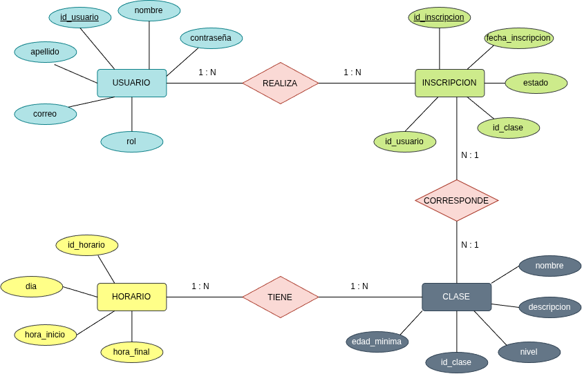
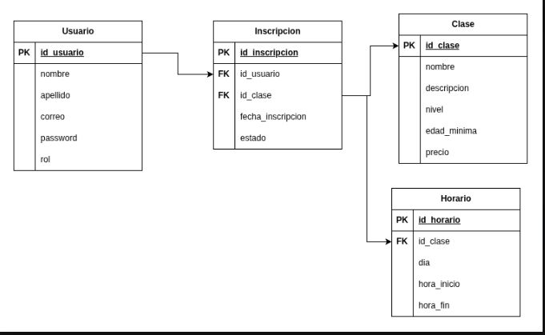
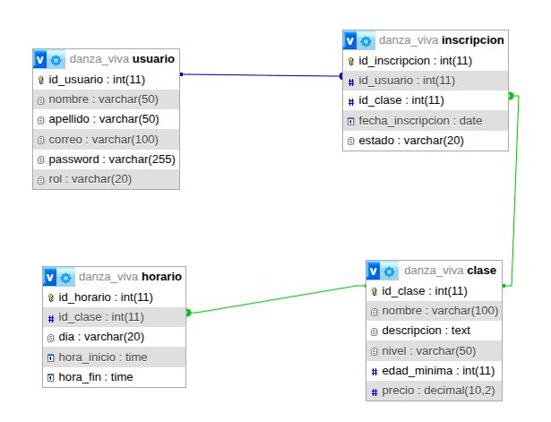

# Danza Viva Academy

## Descripción

Danza Viva Academy es un sitio web desarrollado para una academia
de danzas creada como emprendimiento en el año 2032.

El sitio permite presentar la academia, consultar las clases,
visualizar los horarios y realizar el registro e inscripción de
estudiantes.

También cuenta con un sistema de usuarios conectado a una base
de datos MySQL.

---

# Planteamiento del problema

## Problema

En el año 2032 se crea Danza Viva Academy, una academia dedicada
a la formación en diferentes estilos de danza.

La falta de un sistema web dificulta la presentación de la
información de la academia y la organización de los datos de los
estudiantes e inscripciones.

## Causas

- Falta de presencia digital.
- Información disponible principalmente de forma presencial.
- Registro manual de estudiantes.
- Dificultad para organizar las inscripciones.
- Dificultad para consultar los horarios.

## Consecuencias

- Los interesados pueden desconocer los servicios.
- Se puede perder información.
- Pueden presentarse errores en los registros.
- La consulta de horarios puede ser poco práctica.

## Aporte

El proyecto permite centralizar la información de la academia,
mostrar las clases y horarios y almacenar los datos de los
estudiantes mediante una base de datos.

---

# Objetivo general

Desarrollar un sitio web para Danza Viva Academy que permita
presentar sus servicios, consultar clases y horarios y gestionar
el registro e inscripción de estudiantes.

---

# Tecnologías

- HTML
- CSS
- Tailwind CSS
- PHP
- MySQL
- XAMPP
- phpMyAdmin
- GitHub
- InfinityFree
- diagrams.net

---

# Base de datos

La base de datos se llama:

danza_viva

## Tablas

### usuario

Contiene la información de los usuarios registrados.

### clase

Contiene las clases ofrecidas por la academia.

### horario

Contiene los horarios de las clases.

### inscripcion

Registra las inscripciones de los estudiantes.

---

# ÉPICAS E HISTORIAS DE USUARIO

Las épicas e historias de usuario del proyecto fueron definidas teniendo en cuenta
las principales funciones que tendrá el sistema de Danza Viva Academy.

---

# ÉPICA 1: Consulta de información de la academia

## HU-1 - Consulta de información de la academia

**Quién:** Visitante

**Qué:** Visualizar información general sobre Danza Viva Academy.

**Para qué:** Conocer la academia antes de decidir si desea tomar clases.

### Historia de usuario

> Como visitante, quiero conocer información general de Danza Viva Academy
> para saber qué ofrece la academia.

### Criterios de aceptación

- El sistema debe mostrar información general de la academia.
- Debe mostrar una descripción clara de la actividad que realiza.
- La información debe estar organizada y ser fácil de leer.

### Información adicional

- Se debe utilizar un lenguaje sencillo.
- La información debe estar disponible desde la página principal o la sección
  "Sobre la academia".

---

# ÉPICA 2: Consultar información de una clase

## HU-2 - Consultar información de una clase

**Quién:** Estudiante interesado en una clase

**Qué:** Visualizar información detallada de una clase.

**Para qué:** Conocer las características de la clase antes de inscribirse.

### Historia de usuario

> Como estudiante, quiero consultar la información de una clase para saber
> si es adecuada para mí.

### Criterios de aceptación

- El sistema debe mostrar el nombre de la clase.
- Debe mostrar su descripción.
- Debe mostrar el nivel.
- Debe mostrar la edad mínima.
- Debe mostrar el precio.

### Información adicional

- La información debe ser clara y resumida.
- Los datos deben mantenerse actualizados.

---

# ÉPICA 3: Registro y acceso de usuarios

## HU-3 - Crear una cuenta

**Quién:** Visitante

**Qué:** Registrarse en el sistema.

**Para qué:** Crear una cuenta para poder realizar una inscripción.

### Historia de usuario

> Como visitante, quiero crear una cuenta en Danza Viva Academy para poder
> inscribirme a una clase.

### Criterios de aceptación

- El sistema debe solicitar nombre.
- Debe solicitar apellido.
- Debe solicitar correo electrónico.
- Debe solicitar una contraseña.

### Información adicional

- Los usuarios registrados tendrán inicialmente el rol de estudiante.
- La contraseña debe almacenarse de manera segura.

---

# ÉPICA 4: Inscripción a clases

## HU-4 - Inscribirse a una clase

**Quién:** Estudiante registrado

**Qué:** Realizar una inscripción a una clase.

**Para qué:** Registrar su participación en una clase de danza.

### Historia de usuario

> Como estudiante, quiero inscribirme a una clase para poder participar
> en las actividades de la academia.

### Criterios de aceptación

- El usuario debe haber iniciado sesión.
- El sistema debe mostrar las clases disponibles.
- El estudiante debe poder seleccionar una clase.
- El sistema debe guardar la inscripción en la base de datos.

### Información adicional

- Un estudiante no debe poder registrarse dos veces en la misma clase.
- Después de realizar la inscripción se debe mostrar una confirmación.

---

# ÉPICA 5: Consultar estudiantes registrados

## HU-5 - Consultar estudiantes registrados

**Quién:** Administradora

**Qué:** Consultar los estudiantes registrados.

**Para qué:** Llevar un control de las personas que utilizan el sistema.

### Historia de usuario

> Como administradora, quiero consultar los estudiantes registrados para llevar
> un control de los usuarios de la academia.

### Criterios de aceptación

- El sistema debe mostrar los estudiantes registrados.
- Debe mostrar nombre y apellido.
- Debe mostrar el correo electrónico.

### Información adicional

- La contraseña de los usuarios nunca debe mostrarse.

---

# ÉPICA 6: Identificar horarios disponibles

## HU-6 - Identificar horarios disponibles

**Quién:** Estudiante

**Qué:** Consultar los horarios asociados a una clase.

**Para qué:** Seleccionar una clase teniendo en cuenta su disponibilidad de tiempo.

### Historia de usuario

> Como estudiante, quiero conocer los horarios de una clase para saber cuál
> puedo elegir según mi disponibilidad.

### Criterios de aceptación

- El sistema debe relacionar cada clase con sus horarios.
- Debe mostrar claramente el día y la hora.
- No debe mostrar horarios que no estén registrados.

### Información adicional

- La información será administrada desde la base de datos.
- Los horarios podrán ser modificados por la administradora.

---

# 🗃️ DIAGRAMAS DE LA BASE DE DATOS

## 1. Modelo Entidad-Relación

El modelo entidad-relación representa las entidades principales del sistema y las
relaciones que existen entre ellas.

En este proyecto se tienen las siguientes entidades:

- USUARIO
- CLASE
- HORARIO
- INSCRIPCION

Las relaciones principales son:

- Un usuario puede realizar varias inscripciones.
- Una clase puede tener varias inscripciones.
- Una clase puede tener varios horarios.

### Diagrama

---

## 2. Modelo Relacional

El modelo relacional transforma las entidades del modelo entidad-relación en tablas
de una base de datos.

En este modelo se identifican:

- Claves primarias (PK).
- Claves foráneas (FK).
- Campos de cada tabla.
- Relaciones entre las tablas.

Las tablas utilizadas son:

- USUARIO
- CLASE
- HORARIO
- INSCRIPCION

### Diagrama

---

## 3. Modelo Físico

El modelo físico representa la implementación de la base de datos en MySQL.

La base de datos utilizada en el proyecto es:

`danza_viva`

Las tablas creadas son:

- usuario
- clase
- horario
- inscripcion

### Diagrama

---

